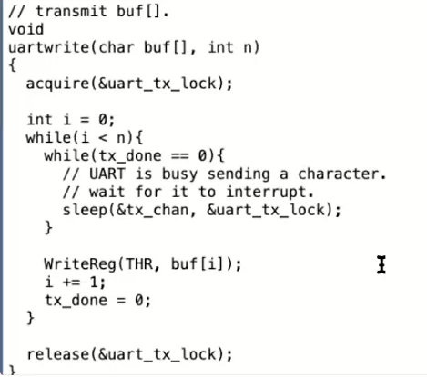
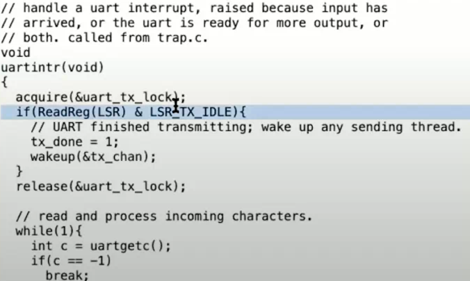
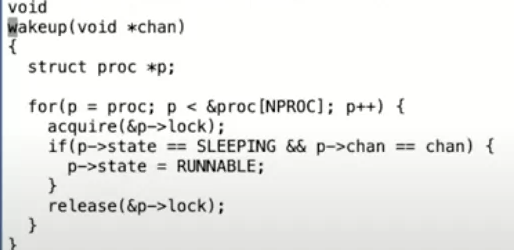
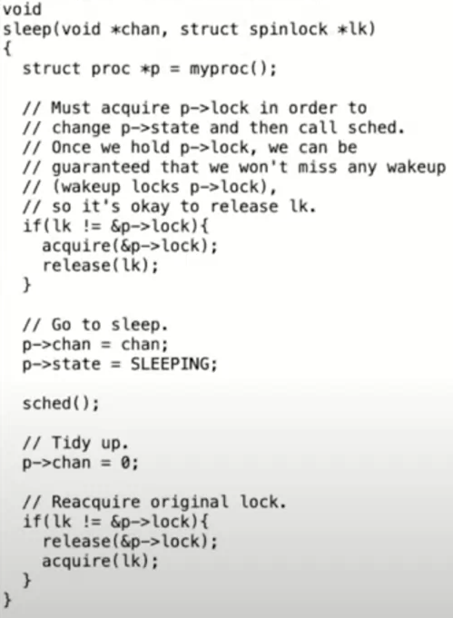
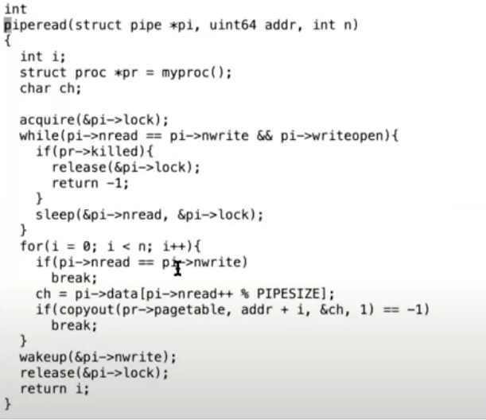
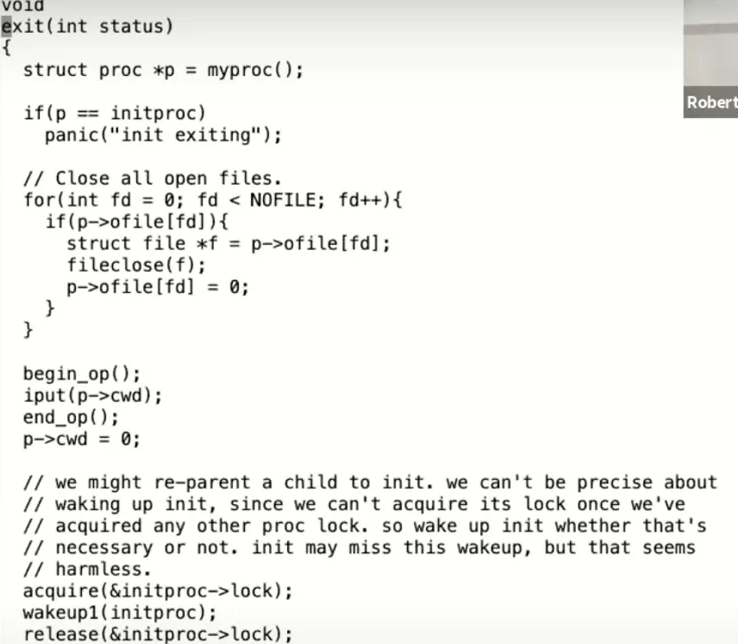
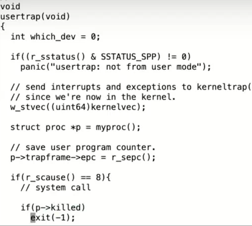

## coordination：sleep + wake up

进程在等待特定事情时(如来自于其他进程pipe，读取磁盘IO，调用wait等)，可以通过sleep让出资源(类似switch函数调用)。

#### 以uart过程为例子

当shell调用write系统调用后，最终会走到uartwrite函数中，其中会向uart硬件一个一个字符写入(实际操作系统中可能为批次写入，如一次写入16个字符等)。

每当传送完一个字符writereg后，会调用sleep让出资源进行等待；在uart完成字符传输后，会触发一个中断uartintr。当检查到传输完成后，代码会将tx_done设置为1，并调用wakeup函数。这个函数会使得uartwrite中的sleep函数恢复执行(**这里并不是说直接变为running状态，而是变为runnable作为备选**)。

同时为了保证sleep与wakeup一一对应，sleep函数和wakeup函数都带有一个叫做sleep channel的参数。我们在调用wakeup的时候，需要传入与调用sleep函数相同的sleep channel。

#### uart为例：coordination中的锁机制lost wakeup

在uartwrite和uartintr两个函数之间，即wakeup与sleep之间，是需要锁来协调工作的。

- 第一个原因是done标志位，任何时候我们有了共享的数据，我们需要为这个数据加上锁。
- 另一个原因是两个函数都需要访问UART硬件，通常来说让两个线程并发的访问memory mapped register是错误的行为。

因此需要在两个函数中加锁（condition lock）来避免对于done标志位和硬件的竞争访问。

方案1：不能单纯地在sleep开头获取锁，在writereg之后释放锁，因为这样会使得sleep过程中一直持有锁，使得wakeup过程中不断尝试去获取锁

方案2：也不能在sleep开头获取锁，在sleep之前释放锁，这在sleep与释放锁之间有一个间隙，可能会有其他wakeup的发生。

最终方案：因此考虑将锁作为参数传入sleep函数中：，sleep承诺可以原子性的将进程设置成SLEEPING状态，同时释放锁。这样wakeup就不可能看到这样的场景：锁被释放了但是进程还没有进入到SLEEPING状态。所以sleep这里将释放锁和设置进程为SLEEPING状态这两个行为合并为一个原子操作。

在wakeup中仅仅进行简单的逐进程访问，每次访问都会获取锁

而在sleep中，在释放当前锁之前，会先获取当前进程的锁，以保证在释放传入的锁和设置sleep状态之间发生wakeup。在sleep中调度器线程释放进程锁之后，wakeup才能终于获取进程的锁，发现它正在SLEEPING状态，并唤醒它。

#### pipe为例：

在 uart场景中，sleep等待的condition是发生了中断并且硬件准备好了传输下一个字符。

**piperead中**：以pi->lock作为condition lock，以确保不会发生lost wakeup，直到pi->nwrite大于pi->nread，也就是写入pipe的字节数大于被读取的字节数

**pipewrite中**：向pipe缓存中写数据。

而我们想要避免这样的风险：在piperead函数检查发现没有字节可以读取，到piperead函数调用sleep函数之间，另一个CPU调用了pipewrite函数。因为这样的话，另一个CPU会向pipe写入数据并在piperead进程进入SLEEPING之前调用wakeup，进而产生一次lost wakeup。

如果一个进程向pipe中写入了一个字节，这个进程会调用wakeup进而同时唤醒所有在读取同一个pipe的进程。但是因为pipe中只有一个字节并且总是有一个进程能够先被唤醒，

#### 系统调用为例

##### exit调用

关闭一个进程时，会面临两个问题：

- 首先我们不能直接单方面的摧毁另一个线程，因为：另一个线程可能正在另一个CPU核上运行，并使用着自己的栈；也可能另一个线程正在内核中持有了锁；也可能另一个线程正在更新一个复杂的内核数据
- 另一个问题是，即使一个线程调用了exit系统调用，并且是自己决定要退出。它仍然持有了运行代码所需要的一些资源，例如它的栈，以及它在进程表单中的位置。当它还在执行代码，它就不能释放正在使用的资源。

在exit()中，会完成如下操作：

- 释放进程的内存和page table
- 关闭已经打开的文件
- 通过wakeup唤醒父进程，父进程会从wait系统调用中唤醒，所以exit最终会导致父进程被唤醒：每一个正在exit的进程，都有一个父进程中的对应的wait系统调用。父进程中的wait系统调用会完成进程退出最后的几个步骤。
- 设置这些子进程的父进程为init进程
- 进程的状态被设置为ZOMBIE。
- 最终，通过调用sched函数进入到调度器线程。

##### wait()调用

- 当一个进程调用了wait系统调用，它会扫描进程表单，找到父进程是自己且状态是ZOMBIE的进程
- 之后由父进程调用的freeproc函数，来完成释放进程资源的最后几个步骤。
  - 这里释放了trapframe，释放了page table。如果我们需要释放进程内核栈，那么也应该在这里释放。但是因为内核栈的guard page，我们没有必要再释放一次内核栈。
  - 如果由正在退出的进程自己在exit函数中执行这些步骤，将会非常奇怪。

wait不仅是为了父进程方便的知道子进程退出，wait实际上也是进程退出的一个重要组成部分。这就是为什么当一个进程退出时，它的子进程需要变成init进程的子进程。init进程的工作就是在一个循环中不停调用wait，因为每个进程都需要对应一个wait，这样它的父进程才能调用freeproc函数，并清理进程的资源。

##### kill()调用

他会扫描进程表单，找到目标进程。然后只是将进程的proc结构体中killed标志位设置为1。如果进程正在SLEEPING状态，将其设置为RUNNABLE。这里只是将killed标志位设置为1，并没有停止进程的运行。

而目标进程运行到内核代码中能安全停止运行的位置时，会检查自己的killed标志位，如果设置为1，目标进程会自愿的执行exit系统调用。你可以在trap.c中看到所有可以安全停止运行的位置，

所以kill系统调用并不是真正的立即停止进程的运行，它更像是这样：如果进程在用户空间，那么下一次它执行系统调用它就会退出，又或者目标进程正在执行用户代码，当时下一次定时器中断或者其他中断触发了，进程才会退出。所以从一个进程调用kill，到另一个进程真正退出，中间可能有很明显的延时。