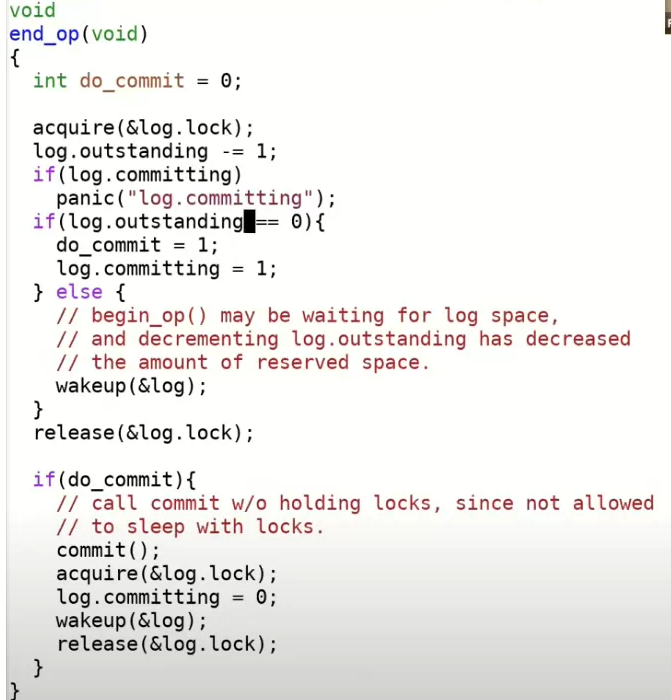
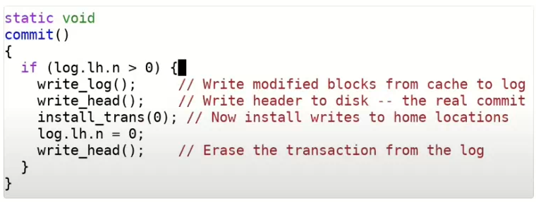
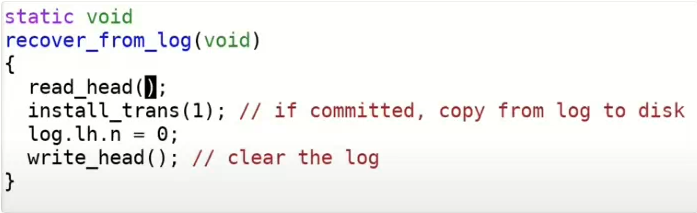

## File system

文件系统的目的是提供一系列的API，方便用户对存储数据进行便利访问。


#### 文件系统结构

**数据结构**：维护了如下信息

- inode：代表一个文件的对象，并且它不依赖于文件名。
  - 编号：实际上，inode是通过自身的编号来进行区分的，这里的编号就是个整数。所以文件系统内部通过一个数字，而不是通过文件路径名引用inode。
  - nlink：跟踪指向这个inode的文件名的数量
  - type：表示inode为文件还是目录或者未使用
  - size：文件数据多少字节
  - 12个direct block number
  - 1个indirect block number：它对应了磁盘上一个block，这个block包含了256个block number，
- openfd count：当前打开了文件的文件描述符计数。
- offset：维护write和read针对文件的offset参数

##### 层次结构：从下到上

- 磁盘：提供了持久化存储。
- buffer cache：避免频繁的读写磁盘。这里我们将磁盘中的数据保存在了内存中。
- logging层：
- inode cache：inode通常小于一个disk block，所以多个inode通常会打包存储在一个disk block中。为了向单个inode提供同步操作，XV6维护了inode cache。
- inode
- file name，文件描述符


##### 从文件系统看磁盘：

从文件系统的角度来看磁盘还是很直观的。因为对于磁盘就是读写block或者sector，我们可以将磁盘看作是一个巨大的block的数组，数组从0开始，一直增长到磁盘的最后。

- block0：用作boot sector启动操作系统
- block1：super block，保存大部分文件系统信息
- block2-31：log块，
- block32-44：保存了inode信息，每个inode64bytes
- block45：bitmap，记录了各个数据block是否空闲。
- block46- ：数据block


例子：执行echo “hi" > x过程中访问文件系统的block位置：

```
--create the file
write33	标记一个inode为使用
write33	写入inode基本信息
write46	写入根目录的data block
write32	修改根目录大小
write33	
--write "hi" to file
write45	更新bitmap，扫描bitmap来找到一个还没有使用的data block
write595 写入h
write595 写入i
write33	修改inode大小
--write "\n" to file
write595
write33
```


#### Crash recovery

解决方案：logging。

- 基本思想类似于lock，将操作打包为原子操作 
- why：当crash发生在连续的对文件系统的操作之间时，可能导致一些文件系统的困扰，如无法正确建立inode与data block的正确对应关系、文件夹内容与实际显示的内部文件对应问题
- logging的正确性由**write ahead rul**e来保证。故障恢复相关的业务中经常看到write ahead rule或者write ahead log（WAL）。write ahead rule的意思是，你必须在做任何实际修改之前，将所有的更新commit到log中。

##### 基本步骤

- log write：当需要更新文件系统时，我们并不是更新文件系统本身，而是记录log
- commit op：当文件系统的操作结束，会向log头部位置写入之前完整操作数目
- install log：将block从log分区移到文件系统分区。
- clean log：清除log实际上就是将属于同一个文件系统的操作的个数设置为0。

通过commit分界线保证完整的文件系统操作的原子性。


##### 通过begin_op与end_op()两个函数来划分一个完整的文件系统操作

在两个函数之间，内存的数据会更新，但磁盘中的数据不会改变。

- 比如其中的ialloc函数，并不会直接调用bwrite(向磁盘写入数据)，而是调用log_write。。任何一个文件系统调用的begin_op和end_op之间的写操作总是会走到log_write。log_write函数位于log.c文件，
- log_write则会向bcache中写入数据

在end_op中我们会将数据写入到log中，之后再写入commit record或者log header。



- 首先执行commit()：
  -  
  - 首先是write_log。这基本上就是将所有存在于内存中的log header中的block编号对应的block，从block cache写入到磁盘上的log区域中（注，也就是将变化先从内存拷贝到log中）。
  - write_head会将内存中的log header写入到磁盘中：读取log的header block。将n拷贝到block中，将所有的block编号拷贝到header的列表中。最后再将header block写回到磁盘。实际的commit就发生在这个write_head函数中。
  - install_trans函数将block数据从log中拷贝到了实际的文件系统block中。
  - 最后一个write_head将log header中的n设置为0，再将log header写回到磁盘中。将n设置为0的效果就是清除log。


##### recovering过程

当系统crash并重启过程中，会调用initlog()，这个函数内部会调用recover_from_log()，该函数操作类似于commit()函数。




#### 三个挑战

##### cache eviction

问题：向bcache中写入新的块，但bcache满了之后，需要选出要写回到磁盘的block，但是这明显违反了文件系统操作的原子性（要将完整的对文件系统的操作一次性写入）。

解决：在log_write中调用了一个叫做bpin的函数，将block固定在bcache中。

##### 文件系统的操作必须适配log的大小

问题：在XV6中，总共有30个log block。文件系统操作必须能放在log空间中。如果一个文件系统操作尝试写入超过30个block，那么意味着部分内容需要直接写到文件系统区域，而这是不被允许的，因为这违背了write ahead rule。

解决：比如进行一些write file操作时，对应的文件系统操作会很大，因此如果写入的block数超过了30，那么一个写操作会被分割成多个小一些的写操作。这里整个写操作不是原子的。

##### 并法文件系统调用

问题：假设我们有一段log，和两个并发的执行的transaction，其中transaction t0在log的前半段记录，transaction t1在log的后半段记录。可能我们用完了log空间，但是任何一个transaction都还没完成。此时不能commit任何文件系统操作

解决：所以必须要保证多个并发transaction加在一起也适配log的大小。所以当我们还没有完成一个文件系统操作时，我们必须在确保可能写入的总的log数小于log区域的大小的前提下，才允许另一个文件系统操作开始。

XV6通过限制并发文件系统操作的个数来实现这一点。在begin_op中，我们会检查当前有多少个文件系统操作正在进行。如果有太多正在进行的文件系统操作，我们会通过sleep停止当前文件系统操作的运行，并等待所有其他所有的文件系统操作都执行完并commit之后再唤醒。这里的其他所有文件系统操作都会一起commit。有的时候这被称为group commit，因为这里将多个操作像一个大的transaction一样提交了，这里的多个操作要么全部发生了，要么全部没有发生。


#### 实际情况：ext3文件系统

在log在开始的部分，是一个super block，其中包含了log中第一个有效的transaction的起始位置和序列号

- 起始位置就是磁盘上对应的log分区的block编号
- 序列号就是前面提到的每个transaction都有的序列号。用来标识每个transaction

而对于每个transaction，其中包含了(其中decriptor block 与 commit block可以使用魔法数来进行区分)

- 起始块为descriptor block：包含了log数据对应的实际block编号
- data block
- 最后一个：commit block


##### 性能提升

而相比于xv6，主要采用了三种方式进行性能提升。

- 异步的（asynchronous）系统调用：系统调用在写入到磁盘之前就返回了，系统调用只会更新缓存在内存中的block，并不用等待写磁盘操作。
- 批量执行（batching）的能力：在任何时候，ext3只会有一个open transaction。ext3中的一个transaction可以包含多个不同的系统调用。
  - 因此每个transaction是以时间为单位的，每隔一定时间重开一个transaction
  - 优势
    - 通过这种方式分摊了transaction带来的固有的损耗。固有的损耗包括写transaction的descriptor block和commit block
    - 更容易触发write absorption：避免对某个块进行重复的操作而导致的反复更新磁盘上的数据，这样在内存中就能完成
    - disk scheduling：一次性的向磁盘的连续位置写入1000个block，要比分1000次每次写一个不同位置的磁盘block快得多。
- 并发（concurrency）：
  - 一个是系统调用并发：系统调用不必等待其他的系统调用完成，它可以直接修改作为transaction一部分的block
  - 另一个是transaction之间的并发：尽管只有一个open transaction可以接收系统调用，但是其他之前的transaction可以并行的写磁盘
    - 可能包括一个open transaction，若干个正在commit到log的transaction，若干个正在向文件系统block写数据的transaction，若干个正在被释放的transaction


##### 恢复过程

如图中例子所示：我们在log中有一个super block，之后是transaction T6，T7，T8，在T8之后是一个已近被释放了log空间的T5，假设T8已经用了T5的一部分空间。并且现在super block指向的是T6的起始位置，因为T6是最早的transaction。

- 首先通过super block找到最早的transaction T6

- 然后从descriptor block中读取data block数目，并最终扫描到commit block

- 同理处理T7,T8
- 当扫描完T8，读取下一个块发现并不是descriptor block，则认为结束
- 或者根据T8的descriptor block找到的最后一个块并不是commit块，表明T8并没有完成logging，也同样结束


