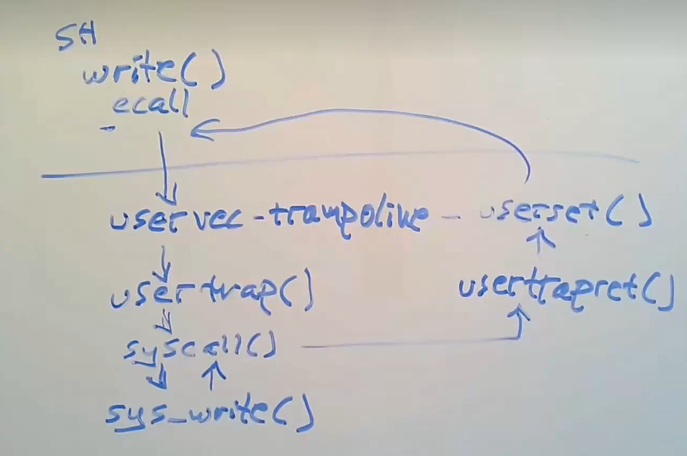
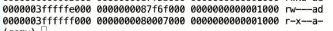

## xv6中系统调用的具体过程

### 基本的寄存器

- 32个寄存器
- **PC**：程序计数器
- **MODE**：确定为用户模式还是superisor模式
  - 从用户模式进入内核模式获得的权限并没有那么多：读写CTL、SATP、STVEC、SEPC、SSCRATCH寄存器，可以使用PTE_U(页表标志位)为0的PTE
- **SATP**：指向page table的物理内存地址
  - 在系统调用的内核过程中，仍然受制于page table设置的虚拟空间地址
- **STVEC**：指向内核中处理trap指令的起始地址
- **SEPC**：trap过程中保存程序计数器的值
- **SSCRATCH**：

这些寄存器表明了当前执行系统调用时计算机的状态

### 系统调用流程

1.系统调用(如write) ->  2.执行ecall指令执行系统调用(进入内核空间)  ->  3.跳转到**汇编语言写的**uservec部分(trampoline.s)  ->  4.usertrap()函数(trap.c)  ->  5. syscall()  ->  6.sys_write()(sysproc.c)  ->  7.返回syscall()  ->  8.usertrapret()(trap.c)  -> 9. userset()(trampoline.s)，返回用户空间  ->  10.恢复到ecall后续的执行

#### 1. 初始流程

当执行系统调用时，会执行关联到shell中的片段(usys.s)：将对应的系统调用号(SYS_write)存入a7寄存器中，然后调用ecall指令。

- 可以注意到程序计数器pc，堆栈指针都在距离0比较近的位置，这表明当前代码在用户空间中
- 当前的page table仍然是用户空间的page table，可以看到存在两个page，其pte_u标志为0，表示只能在内核空间映射，这两个page分别为frame page和trampoline page
  -  

#### 2. ecall指令

ecall会做三件事：

1. 改变MODE寄存器，将代码从user mode 切换为supervisor mode，
2. 将PC的值保存在了SEPC寄存器中
3. 更新PC，跳转到STVEC寄存器指向的指令，即000003fffff000。

ecall并不会切换page table， 这意味着ecall跳转到的trampoline的代码映射必须存在于每一个用户页表中，也就是上面图中的000003fffff000对应的映射。虽然这部分存在于用户page table中，但是用户无法使用它，因为pte_u标志。

- 这保证了trap是安全的

之所以没有让ecall指令通过硬件完成更多的操作，如切换切换page table，设置sp指向kernel stack，而是交给了软件去做，是为了给操作系统设计者更大的自由(如不切换页表执行调用因为切换page table代价很高等)，这也体现了riscv的设计原则

#### 3. uservec()  (trampoline.s)

起始位置(虚拟地址)即上一部跳转到的000003fffff000。

目前有两个问题：

- 目前不知道kernel page table 的地址
- 修改SATP需要空闲的寄存器，但是当前寄存器内的内容都没有保存

在每个user page table中，都映射了trapframe page的地址(可以在proc.h的tramframe结构体中看到结构)，也就是上图中000003ffffe000，可以保存用户寄存器，这使得在切换page table之前就可以完成对寄存器信息的保存。

- tranframe结构体：包括了kernel_stap, kernel_sp, kernel_trap, epc, kernel_hartid，以及32个寄存器信息，其中前面部分的值都是在进入用户空间之前提前设置好的。
  - kernel_stap：kernel pagetable
  - kernle_sp：内核堆栈指针
  - kernel_trap：下一步执行usertrap()的地址
  - epc：
  -  kernel_hartid：运行当前进程的CPU编号
  - page_table：保存用户页表

而SSCRATCH寄存器中在每次进入用户空间前，会保存trapframe page的地址。

所以，在该部分中

1. 首先交换SSCRATCH与寄存器a0的值，这样就得到了保存寄存器信息的位置信息。

2. 然后依次保存寄存器的值到tramframe中
3. 从trapframe中加载kernel_sp，到sp中。(在每次进入用户空间时，内核都会将trapframe的这个值设置为内核堆栈的值)
4. 加载hartid到tp中
5. 加载usertrap()的地址到t0寄存器中，后续进行跳转。
6. 加载kernel_satp到SATP寄存器中：即切换页表

##### 为什么到这里切换页表时，代码没有崩溃(将地址翻译为其他的位置)？？ ：因为内核页表与用户页表对trampoline部分的映射是相同的。

##### 用户寄存器必须在汇编代码中保存，因为经过编译的语言不能保证一定不会对用户寄存器进行操作，而EPC等寄存器可以在之后的C代码中进行保存

##### 页表的切换只能在trampoline中进行，因为只有这部分内容是同时在内核与用户空间中映射的

#### 4. usertrap()   (trap.c)

1. 改写STVEC内容为kernelvec。
2. 保存用户的程序计数器，从SPEC寄存器中转移到trapframe中的epc中，并将epc+4，因为返回后要执行ecall指令的下一条命令
3. 然后根据不同触发trap的原因进行处理
4. 打开中断
5. 调用syscall()

#### 5. syscall()   (syscall.c)

1. 读取trapfram中a7的值，获取当前系统调用对应的号(这在第一步进行了设置)
2. 根据对应的系统调用号，找到对应的函数实现。

#### 6. sys_write()   (sysfile.c)

完成操作 并将返回值保存在trapframe中的a0中

#### 8. usertrapret()   (trap.c)

返回usertrap()中，并调用usertrapret()。

1. 关闭中断
2. 设置STVEC指向trampoline代码
3. 设置trapframe->kernel_stap为内核kernel stack，这对应上了3.3
4. 设置trapframe->kernel_sp
5. 设置trapframe->trap
6. 设置trapframe->hartid
7. 通过设置sstatus寄存器，来表明要从内核模式进入用户模式
8. 将SPEC寄存器的值设置为trapframe->pc的值，也就是用户空间代码计数值
9. 计算出跳转到他tampoline中userret函数的地址
10. 调用fn进行跳转，包含传入的两个参数：a0  trapframe， a1 user page  table  for STAP

#### 9. userret()  (trampoline.s)

1. 加载 a1即stap到STAP中
2. 交换a0与SSCRATCH值，然后加载32个用户寄存器的值，最终trapframe保存在 

syscall()：在一个表单中，根据传入的代表系统调用的数字进行查找，并执行具体系统调用功能。

